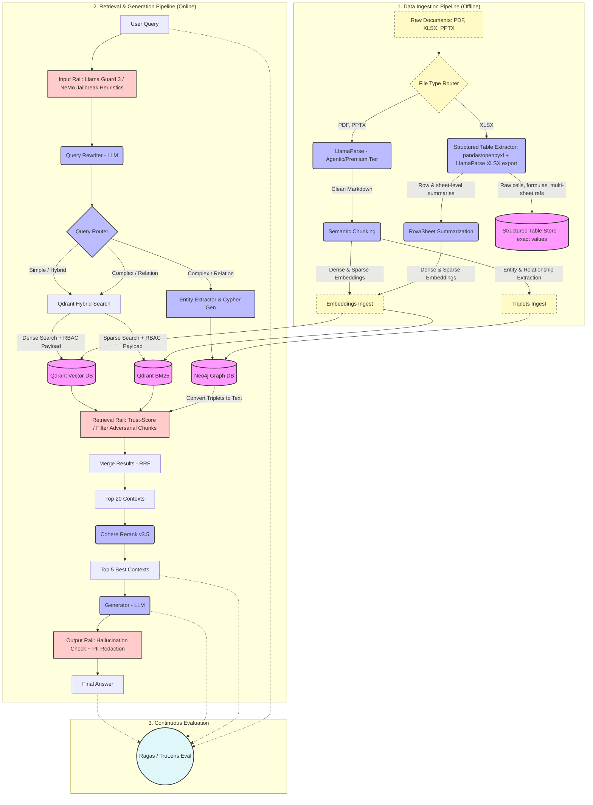

# Enterprise GraphRAG Architecture

Design a microservices-based enterprise knowledge retrieval system that supports PDF, XLSX, and PPTX, while minimizing LLM hallucinations.

## 🏗️ System Architecture (v2 — đã hiệu chỉnh theo thực tế triển khai)

## 🔑 Pain Points Solved

*   **Strict Security (RBAC):** Prior to vector search, Qdrant payload filters are applied matching the user's corporate group claims (JWT/AD), securing sensitive files.
*   **File-type-aware Ingestion:** PDF và PPTX đi qua LlamaParse (tier Agentic/Premium) để giữ cấu trúc bảng phức tạp và merged cells. XLSX được tách route riêng: thay vì flatten thành Markdown (làm mất công thức, tham chiếu chéo sheet, kiểu dữ liệu số), file Excel được parse bằng pandas/openpyxl (hoặc LlamaParse's xlsx export) để giữ một bản "structured table store" chính xác cho truy vấn số liệu, song song với bản tóm tắt theo dòng/sheet để embedding semantic search.
*   **Hybrid Graph-Vector Search:** Combines unstructured semantic search (Qdrant) with structured relation paths (Neo4j Graph DB) combined via Reciprocal Rank Fusion — Qdrant hỗ trợ RRF native qua Query API, không cần tự code fusion logic.
*   **Cost & Latency Routing:** An intelligent router sends simple tasks exclusively to the Qdrant hybrid search path, bypassing expensive Graph querying.
*   **Layered Guardrails (không phải "OR"):** Input rail (Llama Guard 3 + NeMo jailbreak heuristics) bắt direct injection từ user. Một **Retrieval Rail riêng** lọc các chunk độc/adversarial từ Qdrant và Neo4j *trước khi* chúng vào context của generator — lớp này bắt buộc vì input classifier không nhìn thấy nội dung lấy về (indirect injection qua tài liệu nội bộ bị nhúng instruction độc). Output rail kiểm tra hallucination + PII trước khi trả answer. Ba lớp này độc lập và bổ sung cho nhau, không thay thế nhau.
*   **Continuous QA Loop:** Evaluates the pipeline automatically using Ragas/TruLens based on context precision and answer relevance.

## ⚠️ Hạn chế & Lưu ý triển khai thực tế

*   **LlamaParse và bảng phức tạp:** LlamaParse xử lý tốt PDF/PPTX có bảng merged-cell ở tier Agentic/Premium, nhưng việc convert sang Markdown vẫn là biểu diễn dạng text — phù hợp cho semantic search, không phù hợp cho truy vấn số liệu chính xác (vd. "tổng cột C của sheet Q3 là bao nhiêu?"). Đó là lý do XLSX cần một nhánh ingestion riêng giữ bản structured thay vì chỉ dựa vào Markdown.
*   **Indirect prompt injection qua RAG:** Nghiên cứu cho thấy RAG tự nó không chặn được injection nhúng trong tài liệu được retrieve. Input guardrail (Llama Guard/NeMo) chỉ kiểm tra câu hỏi của user, không kiểm tra nội dung trả về từ Qdrant/Neo4j — đây là lý do hệ thống cần Retrieval Rail như một lớp độc lập, không gộp chung với input/output rail.
*   **Phụ thuộc Cohere Rerank:** Đây là external API call thêm latency + cost cho mỗi query; cần có fallback (cross-encoder self-host) nếu yêu cầu air-gapped hoặc giảm chi phí ở quy mô lớn.
*   **Đồng bộ RBAC:** Payload filter trong Qdrant chỉ hiệu quả nếu group claims trong JWT/AD được đồng bộ liên tục với metadata gắn vào từng chunk lúc ingest; tài liệu đổi quyền truy cập sau khi đã index cần một quy trình re-tag, không tự động.
*   **Continuous Eval không tự sửa lỗi:** Ragas/TruLens đo context precision và answer relevance, nhưng đây là lớp quan sát (observability), không tự động chặn câu trả lời sai ở runtime — output rail vẫn là lớp chịu trách nhiệm chặn hallucination trước khi trả user.