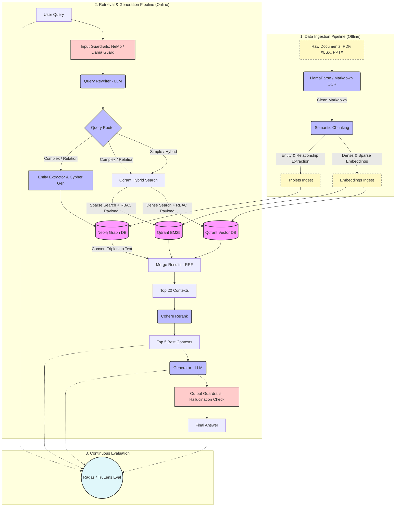

# Enterprise GraphRAG Architecture

Design a microservices-based enterprise knowledge retrieval system that supports PDF, XLSX, and PPTX, while minimizing LLM hallucinations.

## 🏗️ System Architecture

## 🔑 Pain Points Solved

*   **Strict Security (RBAC):** Prior to Vector search, Qdrant payload filters are applied matching the user's corporate group claims (JWT/AD), securing sensitive files.
*   **Complex PDF Parsing:** Heavy tables and unstructured documents are extracted as Markdown via LlamaParse, preventing broken structures.
*   **Hybrid Graph-Vector Search:** Combines unstructured semantic search (Qdrant) with structured relation paths (Neo4j Graph DB) combined via Reciprocal Rank Fusion (RRF).
*   **Cost & Latency Routing:** An intelligent router sends simple tasks exclusively to the Qdrant hybrid search path, bypassing expensive Graph querying.
*   **Dual Guardrails:** Filters unsafe prompts (Input Guardrails) and screens generated output for hallucinations (Output Guardrails).
*   **Continuous QA Loop:** Evaluates the pipeline automatically using Ragas/TruLens based on context precision and answer relevance.
